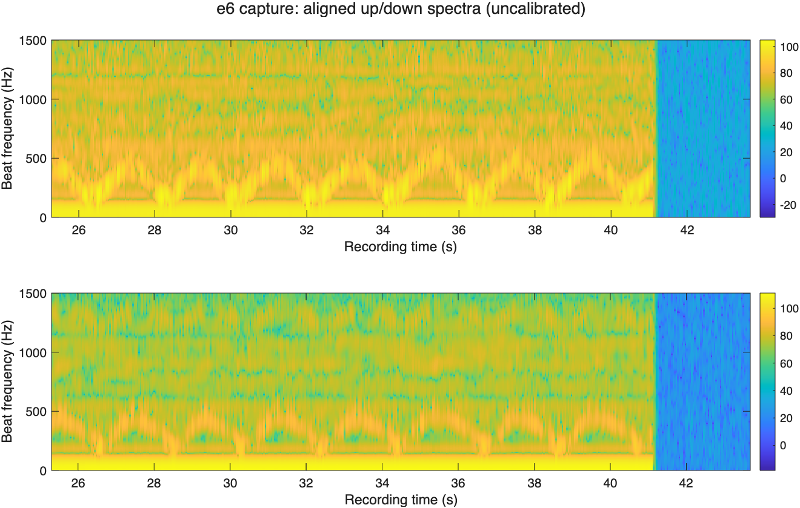

# ChirpMotion

Smartphone FMCW acoustic gesture experiments with retained PCM/WAV captures and MATLAB processing scripts.

> **Development history:** Developed locally using Git before publication. These projects were published to GitHub together, so similar upload dates do not indicate when development began.

## Quick start

Open MATLAB in this repository, then use the branded entry point:

```matlab
samples = chirp_motion('recording.pcm');
```

The entry point preserves the existing function's arguments, errors, and numerical output. Existing script and function names remain available for compatibility. No sensor starts when you open this repository.

## Offline FMCW analysis (base MATLAB)

Process a bundled capture into aligned sweep spectra, beat frequencies, relative delays and spectral change:

```matlab
result = chirp_motion_analyze('e6.pcm', struct('mode', 'alternating'));
imagesc(result.frameTimeSeconds, result.frequencyHz, ...
    20*log10(result.spectra(:,:,1) + eps));
axis xy; xlabel('Time (s)'); ylabel('Beat frequency (Hz)'); colorbar;
save('e6-analysis.mat', 'result');
```

Use `mode='up'` for the single-sweep experiment. The bundled `gesture.pcm` is actually **a stereo WAV file**, with a silent first channel. The new analyzer detects its header and reads it correctly with `struct('inputChannel',2)`. Raw PCM is mono little-endian int16; WAV amplitudes are normalized by `audioread`.

The analyzer generates the historical 961-sample chirps mathematically, finds a normalized correlation match, dechirps each complete sweep, and computes an FFT. It has no Signal Processing Toolbox dependency or inherited-workspace requirement. A known synchronized start can be supplied as `startSample`; automatic alignment otherwise makes delays relative to the matched arrival. Returned prefix/suffix sample counts expose truncation. Outputs are spectral measurements, **not recognized gesture labels or calibrated target positions**. See [method, synchronization and limits](docs/OFFLINE-ANALYSIS.md).



[Inspect the exported measurements](docs/results/e6-spectra.csv). The plot shows the bundled recording, not ground-truth gesture classifications.

## Inputs and workflows

PCM input is signed 16-bit data, returned as a column of doubles without normalization. fmcw.m, fmcw_dou.m and fmcw_dou_rcv.m contain processing experiments and require Signal Processing Toolbox. Review recording paths and device parameters before use. TCPTest.m is a separate live-network experiment and is not part of offline verification.

## Verification

Run `run('tests/smoke_test.m'); run('tests/offline_test.m')` from the repository root. See [verification details](docs/VERIFICATION.md) for the tested scope and unavailable checks. Historical computational source and bundled assets remain byte-identical. The new offline analyzer is a separate supported path.

## License

MIT covers the authorized first-party code and new presentation. Separately owned in-file notices remain applicable.
