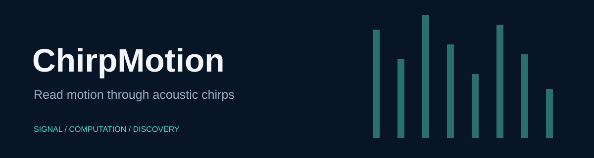

# ChirpMotion

Smartphone FMCW acoustic gesture experiments with retained PCM/WAV captures and MATLAB processing scripts.

> **Development history:** Developed locally using Git before publication. These projects were published to GitHub together, so similar upload dates do not indicate when development began.

## Quick start

Open MATLAB in this repository, then use the branded entry point:

```matlab
samples = chirp_motion('recording.pcm');
```

The entry point preserves the existing function's arguments, errors, and numerical output. Existing script and function names remain available for compatibility. No sensor starts when you open this repository.

## Inputs and workflows

PCM input is signed 16-bit data, returned as a column of doubles without normalization. fmcw.m, fmcw_dou.m and fmcw_dou_rcv.m contain processing experiments and require Signal Processing Toolbox. Review recording paths and device parameters before use. TCPTest.m is a separate live-network experiment and is not part of offline verification.

## Verification

Run `run('tests/smoke_test.m')` from the repository root. See [verification details](docs/VERIFICATION.md) for the tested scope and unavailable checks. Computational source and bundled scientific assets are retained byte-for-byte; the added facade and documentation provide the new presentation.

## License

MIT covers the authorized first-party code and new presentation. Separately owned in-file notices remain applicable.
