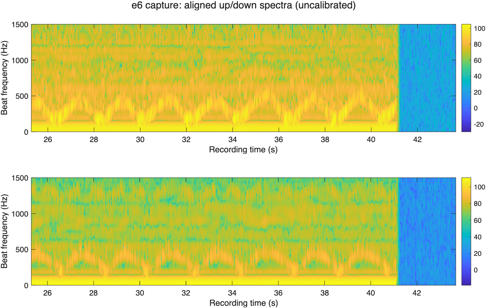

# ChirpMotion

Inspect recorded acoustic chirps with a portable C17 command-line analyzer or the existing MATLAB workflow. The native program streams cycle measurements and optional spectra without retaining the whole recording.

The retained research scripts and recordings originate from [FMCW Acoustic Gesture Recognition](https://github.com/lauren2018/fmcw-acoustic-gesture-recognition) by **Meng Zhou, Wentao Xie and Xiaotong Zhang**, a 2018 SUSTech experiment. The native analyzer, generated demo and earlier offline MATLAB extension are separate additions. [Source and license scope](NOTICE).

## Native analysis, no MATLAB required

On macOS or Linux with a C compiler and make:

```sh
git clone https://github.com/nazeeh111/ChirpMotion.git
cd ChirpMotion
make -C native check demo
```

The demo generates new stereo PCM16 WAVE signals. One contains a known 1 ms delayed chirp, producing a beat near 300 Hz in both sweep directions; another checks automatic alignment after 137 leading samples. It prints the new output directory containing `cycles.csv`, optional `spectra.csv` and `summary.json`.

```sh
native/build/chirpmotion-native --input recording.wav --channel 2 \
  --mode alternating --output new-analysis
```

The supported native inputs are mono raw little-endian int16 PCM or classic PCM16 WAVE at 48 kHz. Stereo requires an explicit channel. These measurements describe spectra and relative acoustic paths; they do not classify gestures or establish calibrated object distances. See [native usage, formats and limits](native/README.md). Existing destinations are refused.

## Read PCM with MATLAB

To read raw PCM samples into MATLAB, run:

```matlab
samples = chirp_motion('recording.pcm');
```

`chirp_motion` forwards to the original `pcmread` function. It reads samples; use the native program above or `chirp_motion_analyze` below for spectral analysis.

## Offline FMCW analysis (base MATLAB)

Process a bundled capture into aligned sweep spectra, beat frequencies, relative delays and spectral change:

```matlab
result = chirp_motion_analyze('e6.pcm', struct('mode', 'alternating'));
imagesc(result.frameTimeSeconds, result.frequencyHz, ...
    20*log10(result.spectra(:,:,1) + eps));
axis xy; xlabel('Time (s)'); ylabel('Beat frequency (Hz)'); colorbar;
save('e6-analysis.mat', 'result');
```

Use `mode='up'` for the single-sweep experiment. The bundled `gesture.pcm` is actually **a stereo WAV file**, with a silent first channel. The new analyzer detects its header and reads it correctly with `struct('inputChannel',2)`. Raw PCM is mono little-endian int16; WAV amplitudes are normalized by `audioread`.

The analyzer generates the historical 961-sample chirps mathematically, finds a normalized correlation match, dechirps each complete sweep, and computes an FFT. It has no Signal Processing Toolbox dependency or inherited-workspace requirement. A known synchronized start can be supplied as `startSample`; automatic alignment otherwise makes delays relative to the matched arrival. Returned prefix/suffix sample counts expose truncation. Outputs are spectral measurements, **not recognized gesture labels or calibrated target positions**. See [method, synchronization and limits](docs/OFFLINE-ANALYSIS.md).



[Inspect the exported measurements](docs/results/e6-spectra.csv). The plot shows the bundled recording, not ground-truth gesture classifications.

## Inputs and workflows

PCM input is signed 16-bit data, returned as a column of doubles without normalization. fmcw.m, fmcw_dou.m and fmcw_dou_rcv.m contain processing experiments and require Signal Processing Toolbox. Review recording paths and device parameters before use. TCPTest.m is a separate live-network experiment and is not part of offline verification.

## Verification

Run `run('tests/smoke_test.m'); run('tests/offline_test.m')` from the repository root. See [verification details](docs/VERIFICATION.md) for the tested scope and unavailable checks. Historical computational source and bundled assets remain byte-identical. The new offline analyzer is a separate supported path.

## License

The original native implementation and generated fixtures are covered by [native/LICENSE](native/LICENSE). The repository MIT license applies to the separate first-party additions and presentation. It does not relicense the retained research code or recordings; [NOTICE](NOTICE) identifies their source and the limits of the recorded license evidence.
